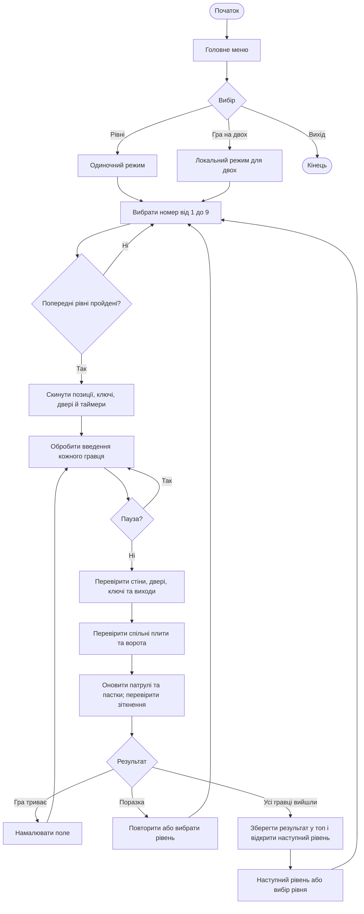
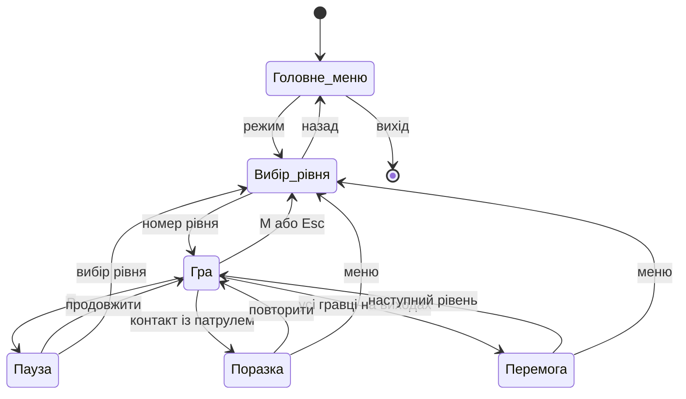

# Алгоритм і стани

```mermaid
flowchart TD
    A([Початок]) --> B[Головне меню]
    B --> C{Вибір}
    C -->|Рівні| D[Одиночний режим]
    C -->|Гра на двох| E[Локальний режим для двох]
    C -->|Вихід| Z([Кінець])
    D --> F[Вибрати номер від 1 до 9]
    E --> F
    F --> LOCK{Попередні рівні пройдені?}
    LOCK -->|Ні| F
    LOCK -->|Так| G[Скинути позиції, ключі, двері й таймери]
    G --> H[Обробити введення кожного гравця]
    H --> I{Пауза?}
    I -->|Так| H
    I -->|Ні| J[Перевірити стіни, двері, ключі та виходи]
    J --> PLATES[Перевірити спільні плити та ворота]
    PLATES --> K[Оновити патрулі та пастки; перевірити зіткнення]
    K --> L{Результат}
    L -->|Гра триває| M[Намалювати поле]
    M --> H
    L -->|Поразка| N[Повторити або вибрати рівень]
    N --> F
    L -->|Усі гравці вийшли| O[Зберегти результат у топ і відкрити наступний рівень]
    O --> P[Наступний рівень або вибір рівня]
    P --> F
```

```mermaid
stateDiagram-v2
    [*] --> Головне_меню
    Головне_меню --> Вибір_рівня: режим
    Вибір_рівня --> Гра: номер рівня
    Вибір_рівня --> Головне_меню: назад
    Гра --> Пауза: P
    Пауза --> Гра: продовжити
    Гра --> Поразка: контакт із патрулем
    Гра --> Перемога: усі гравці на виходах
    Перемога --> Гра: наступний рівень
    Поразка --> Гра: повторити
    Гра --> Вибір_рівня: M або Esc
    Пауза --> Вибір_рівня: вибір рівня
    Перемога --> Вибір_рівня: меню
    Поразка --> Вибір_рівня: меню
    Головне_меню --> [*]: вихід
```
